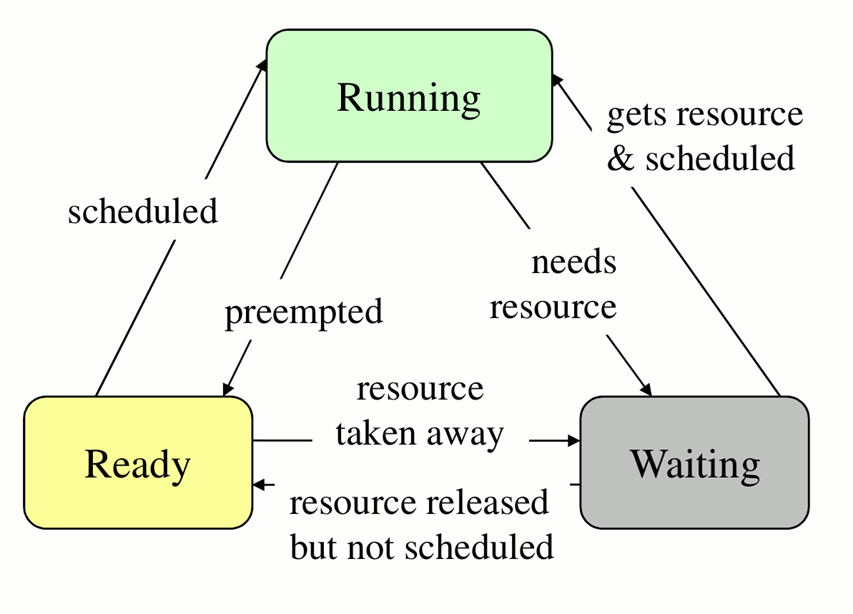
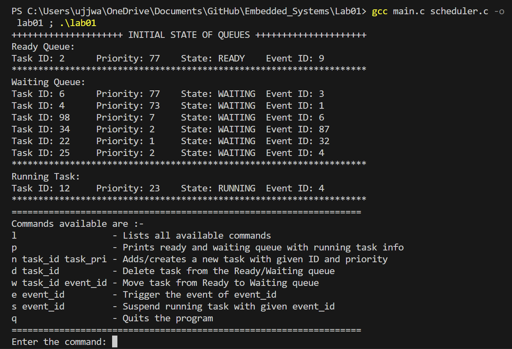

# Assignment 01
This assignment contaions a C program implementation of tassk scheduling for the partial grading of the course E3-257.

## Brief
This is a program illustrating scheduling of tasks in a CPU. A given task can be in one of the three states namely running, waiting or ready state. For keeping track of tasks in different states, this program uses queues. Each task is a structure that have following members:-

1. ```task_id```: This is an ```integer``` which is unique for each task. It acts as the ID of that task.
2. ```task_pri```: This is an ```integer``` that informs about the priority of the task (lower the value higher the priority)
3. ```ptr_context```: For this program this pointer is pointer to ```NULL```.
4. ```task_state``` : This is an ```integer``` that is mapped to the task state as per ```macros``` defined. In this program running, ready and waiting is represented by 0, 1 and 2 respectively.
5. ```event_id```: This is an ```integer``` that represents the event or the resource that task is waiting for to be triggred or released for it to jump to ready state.
6. ```next```: This is a pointer to the next Node/task.

Any task that is in the CPU will either be found in any one of the following:-

1. ```ready_queue```: Queue of ready tasks (sorted according to their priorities)
2. ```waiting_queue```: Queue of waiting tasks.
3. ```running_node```: Pointer that points to the node which is running.

### More about task states
State of the tasks changes according to the image given below:-



1. __Running__: CPU is currently executing the task
2. __Ready__: Needs CPU time but higher priority task is running. Eligible to compete with other Ready tasks for CPU time.
3. __Waiting/Blocked__: Can not continue, waiting for resource data/event/communication. Task requests for the resource that is not available. OS blocks it so that  other tasks can run. Waiting for other task to fill up the buffer. Waiting for button press/timer or DMA interrupt (event).

## Program features
Following are the features of the program:-
1. __Initialization__: The ```init_task.txt``` file act as the starting point of the program. All the queues are given the initial values from this file.
2. __Commands__: User can give the following commands using ```console```
   
| Command            | Description                                            |
|--------------------|--------------------------------------------------------|
| `l`                | Lists all available commands                           |
| `p`                | Prints ready and waiting queue with running task info  |
| `n task_id task_pri`| Adds/creates a new task with given ID and priority     |
| `d task_id`        | Deletes task from the Ready/Waiting queue               |
| `w task_id event_id`| Moves task from Ready to Waiting queue                 |
| `e event_id`       | Triggers the event of event_id                         |
| `s event_id`       | Suspends running task with given event_id              |
| `q`                | Quits the program                                      |
3. __Command Validation__: Commands are checked for the syntax and corresponding error message is generated.
4. __Ease of adding additional commands__: Additional command can be added by just defining it and adding it in ```switch()``` statement of ```run_command()``` function.
 
## Setup

Put ```main.c```, ```scheduler.c```, ```scheduler.h``` and ```init_tasks.txt``` in the same directory. To run the program run the following command in the same directory:-

```bash
> gcc main.c scheduler.c -o lab01 ; .\lab01
```

When program starts it reads the data from the ```init_tasks.txt``` file and fills us the ```ready_queue```, ```waiting_queue``` and ```running_node``` accordingly and displayed on the console with the information of all the available commands. Now new commands can be entered by the user. 



One can add his or her own data in the ```init_tasks.txt``` file in a comma seprated format i.e. ```task ID,priority,state,event ID```. For __example__ if we want to add a waiting(2) task with ID of 67, priority of 5 with event ID of 90 we would add ```67,5,2,90```  to ```init_tasks.txt```.

_NOTE: One can only add waiting(2) or ready(1) task in the ```init_tasks.txt```. Error is generated if given otherwise._

## Running Different commands

### l command
This commands lists all the available coommands.
### p command
This command prints the information of all the tasks that with which CPU is working at the moment.
### n command
This command generates a new task with the given task ID and priority. By default the even ID is 0. An error is generated if the task ID provided by the user is not unique. It also prints the information of the new task which is being added.
### d command
This command delets any waiting or ready task with given task ID and displays its information if deleted successfully. "Task not found" message is generated if the task given for deletion does not exists. Moreover, an error is generated if user tries to delets an running task. 
### w command
This command moves a ready task with the given task ID to the waiting and overwrites its event ID as provided by the user, it also prits the information of the task which is moved. An error is generated if no task with the given task ID is waiting.
### e command
This commands triggers the event given by the user. If any task exists in waiting queue  with the given event ID, it will pushed to ready queue according to their priority. 
### s command
This command suspends the running task if its event ID matches, thereafter, it prints the information of the task which was suspended.
### q command
This commands frees up the memory and quits the program.

## Author
UJJWAL CHAUDHARY, M. Tech. ESE, IISc Bengaluru